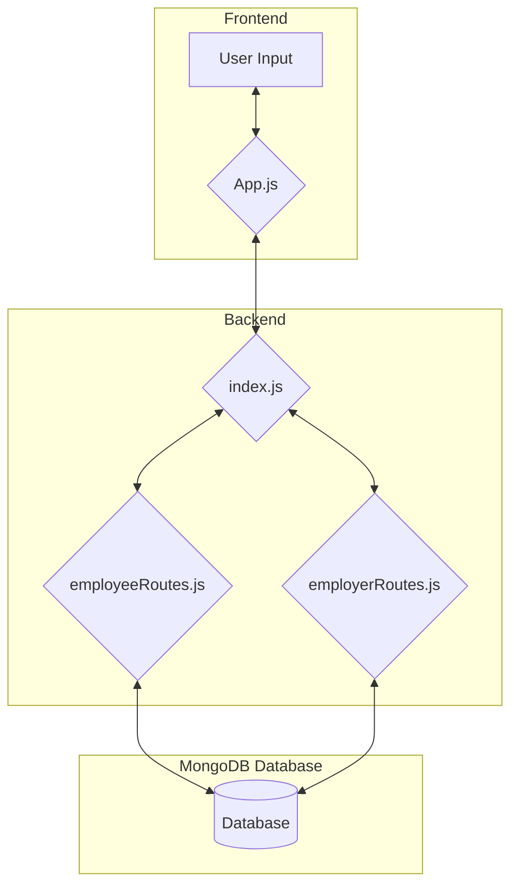

# REC 2024 Documentation 

## 1. Pre-requisites, Motive, and Description

### 1.1 Languages
HTML, CSS, Javascript, and MongoDB used to create this project. All frameworks are included as,

- Bootstrap: Version 5.3.2
- React.js: Version 18.2.0
- Node.js: Version 20.6.0
- Express.js: Version 4.21.0
- Dotenv: Version 16.4.5

## 2. Stack & Installation

### 2.1 Stack

## 3. References

1. [Bootstrap v5.3.3](https://getbootstrap.com/docs/5.3/getting-started/introduction/)
2. [Node.js v23.1.0](https://nodejs.org/docs/latest/api/)
3. [Express.js v4.18.2](https://expressjs.com/en/4x/api.html)
4. [DotEnv v16.3.1](https://www.dotenv.org/docs/)

Developed by:
- [Maksim Sharoika](https://www.linkedin.com/in/maksim-sharoika-713a69162/) 
- [Shema Dabiri](https://www.linkedin.com/in/shema-dabiri/)
- [Simran Brar](https://www.linkedin.com/in/simran-brar-370b63203/)
- [Muhammad Zaman](https://www.linkedin.com/in/mtzamanpk/) 
